# Konfiguruj: příručka

Tato příručka popisuje práci v aplikaci **Konfiguruj** při přípravě konfigurovatelných produktů, jejich publikaci na webu a při práci s **cenovými poptávkami** od zákazníků. Předpokládá aktivní uživatelský účet a po přihlášení přístup do sekce **Nastavení**.

## Veřejná úvodní stránka

Veřejná úvodní stránka shrnuje princip práce v systému: připravíte model produktu, nastavíte konfiguraci, zveřejníte jej a přijímáte poptávky z vloženého konfigurátoru na vlastním webu.

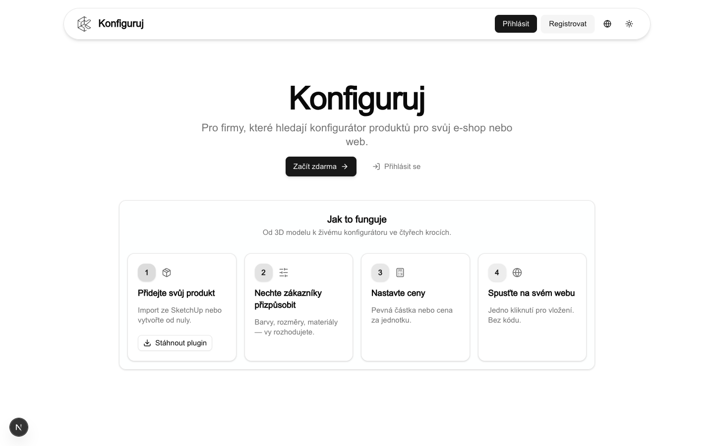

## Přihlášení

Administrace je dostupná přes položku **Přihlásit** v hlavičce nebo odkaz na úvodní stránce. Po úspěšném přihlášení se zobrazí interní část aplikace včetně sekce **Nastavení**.

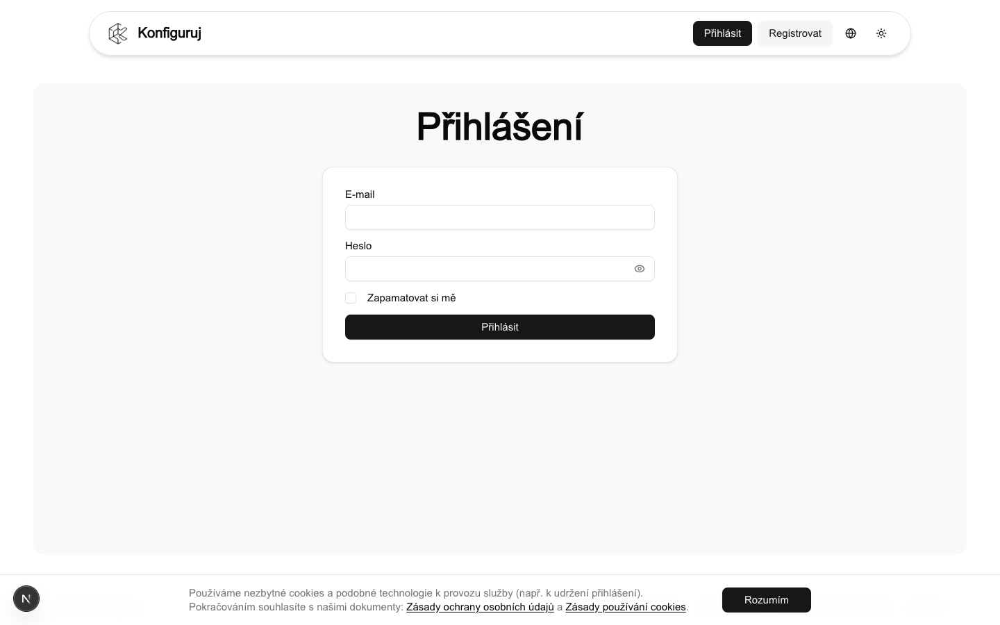

## Registrace účtu

Nový účet založíte přes **Registrovat** ve hlavičce. Vyplníte formulář a udělíte souhlas se zpracováním osobních údajů podle znění stránky.

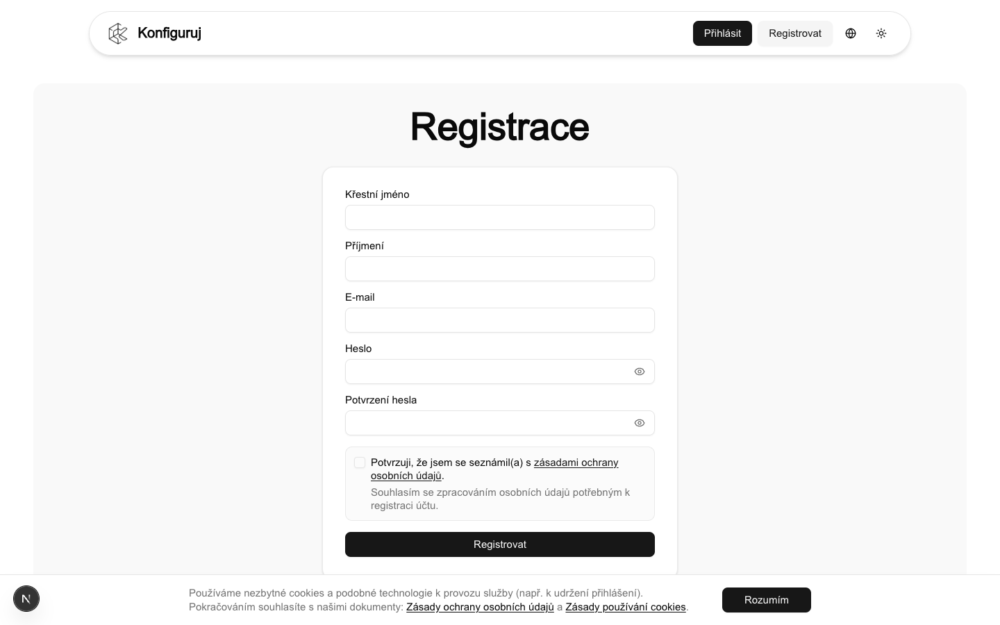

---

## Rozsah práce v aplikaci

V aplikaci spravujete zejména **modely produktů**, tedy výrobky, které má zákazník konfigurovat na webu. U každého modelu určujete **komponenty**, **atributy**, **možnosti**, **ceny** a případně **cenová pravidla**. Dále zajišťujete **publikaci** konfigurátoru, jeho **vložení na web** a zpracování **poptávek** z vloženého formuláře. Na úrovni celého účtu nastavujete společné parametry například v oblasti **e-mailových šablon a notifikací**.

---

## Navigace v sekci Nastavení

Po přihlášení vstupte do sekce **Nastavení**. Levé menu je hlavní navigací administrace; každá položka odpovídá dílčí obrazovce.

- **Dashboard** je vstupní přehled administrace s rychlými akcemi, například k importu modelu nebo k přehledu poptávek.
- **Modely produktů** uvádějí všechny konfigurovatelné výrobky; z této obrazovky zakládáte a upravujete modely, otevíráte správu a náhled.
- **Import ze SketchUp** slouží k nahrání ZIP souboru z exportního pluginu a typicky jako výchozí bod pro nový model.
- **Poptávky** zobrazují žádosti odeslané z vloženého konfigurátoru, včetně seznamu, filtrace a detailu záznamu.
- **E-mail a notifikace** slouží ke správě šablon a adres pro komunikaci se zákazníky a se správcem konfigurátoru.

### Dashboard

Úvodní obrazovka **Nastavení** nabízí přehled, rychlé akce a úvodní tip k přípravě 3D modelu včetně odkazů na návod a stažení pluginu.

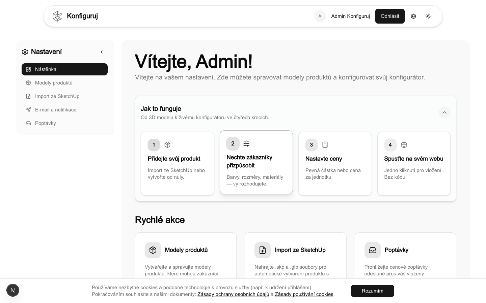

Po otevření konkrétního modelu pracujete s jeho vlastními obrazovkami a záložkami, obvykle **Obecné**, **Ceny**, **Publikování** a **Náhled**. Ve správě modelu upravujete strukturu výrobku: **Komponenty**, **Atributy**, **Možnosti** a související ceny.

---

## Modely produktů

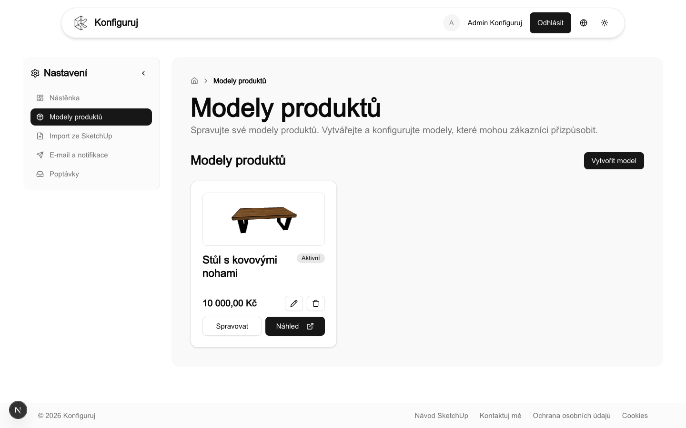

Obrazovka **Modely produktů** je centrálním seznamem výrobků nabízených v systému. Každá položka představuje jeden konfigurovatelný produkt například stůl, postel nebo jiný výrobek na míru.

Nový model přidáte v **Nastavení** → **Modely produktů** tlačítkem **Vytvořit model**, případně přes stav **Vytvořit první model**, pokud v účtu ještě žádný model není. Obsah modelu se obvykle zakládá importem ze SketchUp. Úplné sestavení produktu pouze ručně v administraci bez importovaného podkladu ze SketchUp dosud není běžná varianta workflow.

V akci **Upravit** nastavujete základní údaje modelu, například název, popis, **základní cenu**, **měnu** a přepínač **Aktivní**, který řídí použitelnost modelu v dalších částech aplikace a jeho prezentaci zákazníkům.

Z řádku nebo kartičky modelu typicky využijete některou z akcí níže:

- **Náhled** zobrazí konfigurátor v podobě pro zákazníka pro kontrolu chování, zobrazení a výpočtu ceny.
- **Spravovat** otevře detail modelu a vnitřní strukturu nastavovaných komponent, atributů a cenové logiky.
- **Smazat** trvale odstraní model a je nevratné; používejte jej pouze po ověření, že daný záznam již nepotřebujete.

---

## Struktura produktu v systému

Konfigurace produktu v administraci sestává z navazujících vrstev, které odpovídají tomu, co zákazník později vybírá ve veřejném konfigurátoru.

1. **Komponenty** jsou díly výrobku nebo logické celky modelu, například korpus, deska, nohy nebo úložný prostor. Důležité jsou srozumitelné názvy a pořadí.
2. **Atributy** popisují vlastnosti komponenty například barvu, materiál, šířku nebo typ povrchu. U atributu nastavujete zobrazený název, interní **kód**, typ hodnoty, případně rozsah, jednotku, povinnost a pořadí.
3. **Možnosti** se používají zejména u výčtových atributů a představují jednotlivé volby, například dekor nebo variantu provedení.
4. **Cenové modifikátory** u atributů (v tabulce **cenových pravidel**) říkají, o kolik se změní cena při konkrétní volbě nebo hodnotě.
5. Celková cena aktivní konfigurace vzniká z **základní ceny** modelu plus **modifikátorů podle cenových pravidel** (podrobně v části **Výpočet ceny a cenová pravidla** níže).

Po importu ze SketchUp bývá struktura předvyplněna; měli byste ji zkontrolovat a doladit podle způsobu prezentace zákazníkovi.

---

## Výpočet ceny a cenová pravidla

### Z čeho se složí cena

Koncová cena konfigurace je **základní cena modelu** nastavená u produktu (akce **Upravit**, pole ceny a měny) plus **součet cenových modifikátorů** z pravidel, která dopadnou na aktivní hodnoty atributů. Pravidla tedy nevyměňují základní cenu ani mezi sebou nekombinují násobením jedním vzorcem, ale **jedno po jednom přičítají** (nebo mohou nést zápornou hodnotu, pokud ji tak zadáte) k výchozí částce.

Základní cena vyjadřuje startovní cenu „holého“ výrobku v dané měně. Vše nad to vychází z toho, co zákazník vybere u jednotlivých komponent.

### Jak se pravidla uplatňují

Pravidla se váží na **interní kód atributu** a volitelně na **konkrétní komponentu**. Je-li u pravidla komponenta vyplněná, použije se jen u atributu na téže větvi struktury. Je-li u pravidla **komponenta nevyplněná**, řádek může platit šířeji pro atributy se stejným kódem, než když je komponenta uvedena. Modifikátory ze **všech** vyhovujících řádků se ke základní ceně **sčítají**. U jednoho atributu a jeho aktuální hodnoty vstoupí do součtu nejvýše **jedna** taková položka. Pokud **žádný** řádek hodnotě neodpovídá, u tohoto atributu se k součtu z pravidel nic nepřidá ani neuberá.

U výčtu možností (**ENUM**) se vybere řádek, jehož hodnota **přesně odpovídá** zvolené možnosti. Na kombinaci komponenty, kódu atributu a konkrétní hodnoty volby patří jen jedna platná částka**,** systém duplicitní pravidla pro stejný výběr nepřijímá.

U **celého nebo desetinného čísla** může řádek znamenat buď **přesnou shodu** hodnoty, nebo **interval uzavřený na obou koncích** (**BETWEEN**). Aktuální vstup zákazníka se podle použitého pořadí prochází po řádcích a použije **první** vyhovující řádek, takže překrývající se intervaly snadno způsobí, že jiný řádek se vůbec neuplatní. Po importu ze SketchUp vzniká často jedna položka přes celý povolený rozsah čísla s modifikátorem **0**, který poté nahradíte skutečnými příplatky nebo slevami.

Pro **ANO/NE (BOOLEAN)** stanovíte dopad zvlášť pro hodnoty zapnutého a vypnutého stavu (**true** a **false** podle formuláře pravidla).

### Jednotky a přesnost

Základní cenu produktu zapisujete v **měně modelu** jako běžnou peněžní hodnotu. **Částky příplatků z pravidel** aplikace uvnitř ukládá **v** jemnější dílkové jednotce měny (haléř nebo cent) **kvůli přesnosti součtu.** Ve formuláři pravidel zadejte obvykle částku **ve stejné hlavní jednotce měny** jako u základní ceny**,** rozhraní ji převede do uloženého tvaru. Zobrazená celková cena v náhledu i část uložená k poptávce jsou opět v měně účtu a formátované pro běžné čtení.

### Kde pravidla upravovat a ověřit

Kompletní soupis pravidel upravujete na záložce **Ceny** u příslušného modelu. U jednotlivých voleb v konfigurátoru často pomáhá krátká **cenová nápověda** vedle nabídky. Finální chování si ověřte **záložkou Náhled**, případně ostrým náhledem konfigurátoru před jeho vložením na vlastní web v ostrém provozu.

### Cena na poptávce

Údaj uložený u přijaté poptávky odpovídá výpočtu v okamžiku odeslání formuláře včetně tehdejší základní ceny u modelu i tehdejších pravidel. Změny ceníku po uložení poptávky zpětně tento údaj nemění, slouží jako nabídkový základ pro komunikaci s klientem.

---

## Detail modelu produktu

Detail modelu například po **Spravovat** nabízí záložky pro jednotlivé oblasti správy stejného modelu.

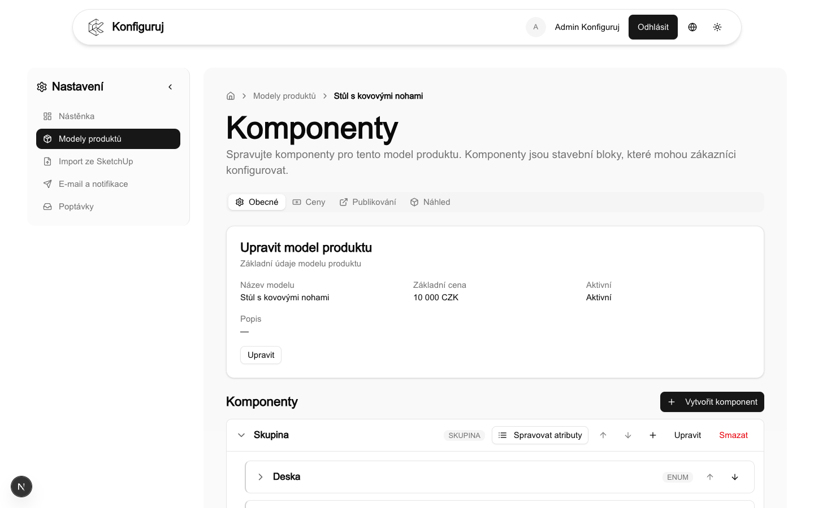

### Obecné

Záložka **Obecné** slouží ke správě struktury modelu a základních prvků. Odtud vstupujete do komponent, atributů a možností při sestavení konfigurační logiky.

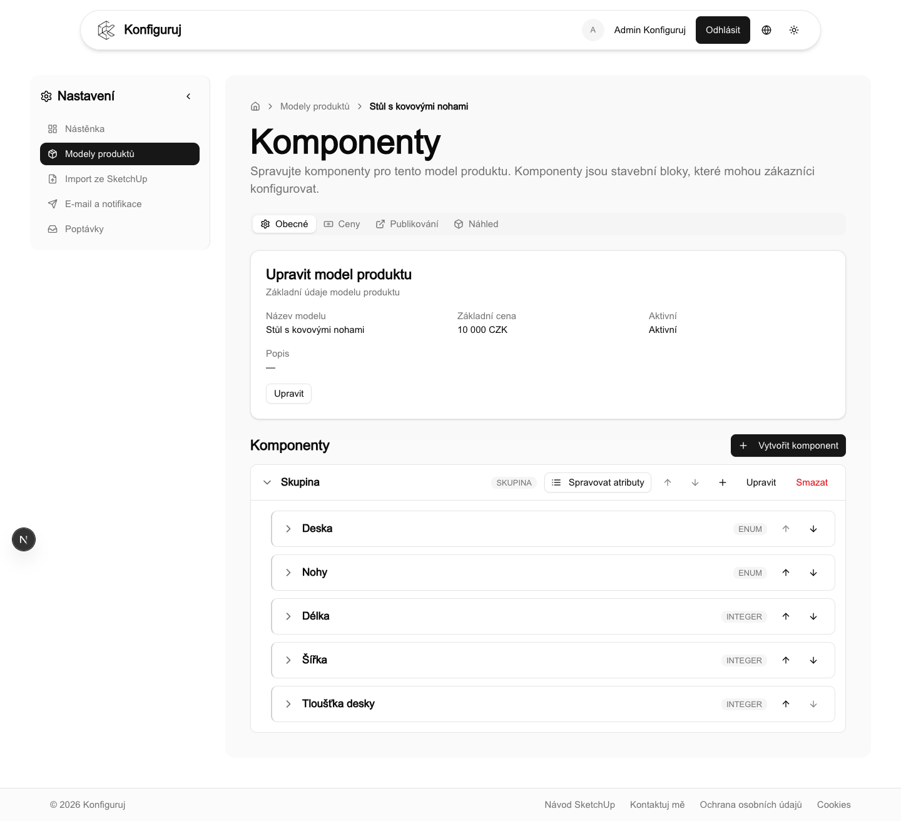

### Ceny

Záložka **Ceny** sdružuje tabulku **cenových pravidel**, ve které se nastavuje vztah hodnot atributů k příplatkům a slevám. Koncept počítání, typy řádků a chování u číselných intervalů najdete výše v kapitole **Výpočet ceny a cenová pravidla**.

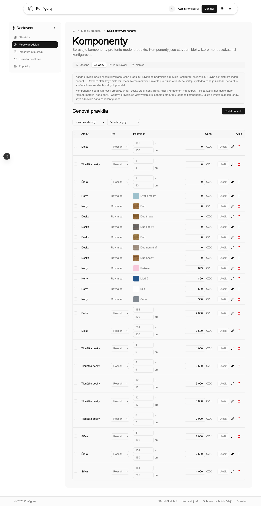

### Publikování

Záložka **Publikování** připravuje model pro veřejné použití: nastavení zveřejnění, veřejné URL pro embed a kód pro vložení na vlastní web.

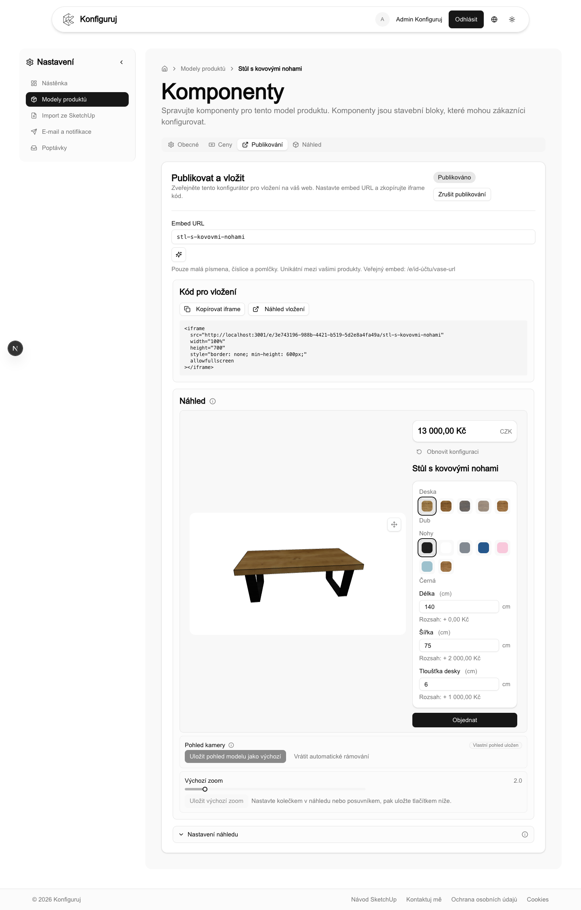

### Náhled

Záložka **Náhled** slouží k ověření chování konfigurátoru před publikací, včetně zobrazení komponent a atributů a souladu výsledné ceny s nastavením.

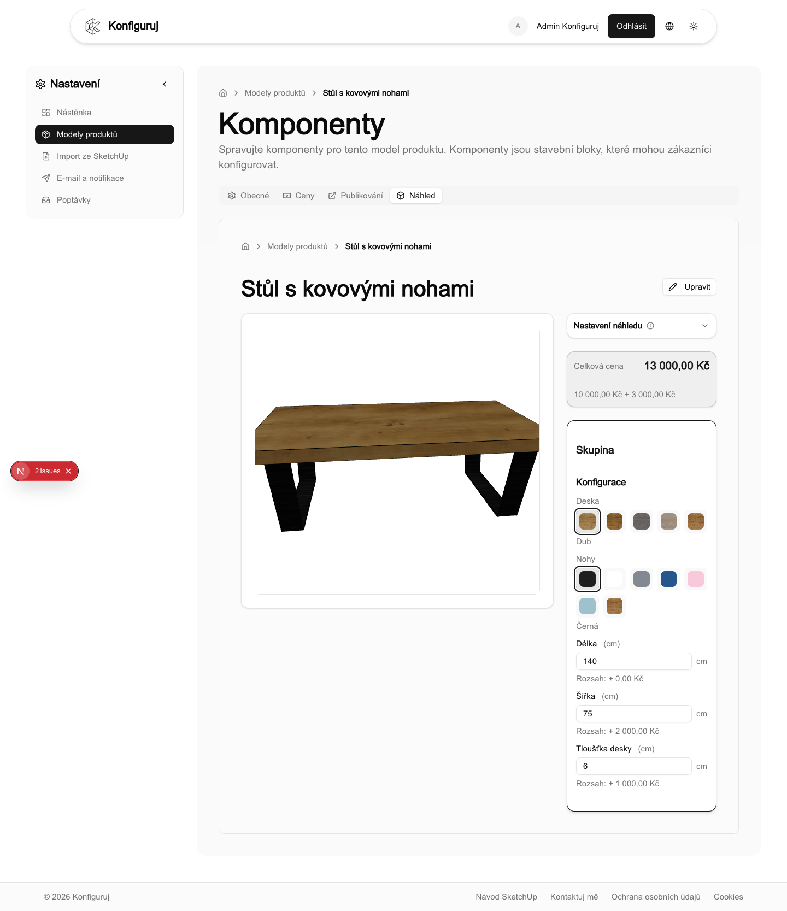

---

## Publikování konfigurátoru na web

U připraveného modelu otevřete stránku nebo záložku **Publikovat a vložit**. Aktivujte stav **Publikováno**, nastavte **Embed URL** a zkopírujte připravený **iframe kód** na vlastní web. Viz také záložku **Publikování** u detailu modelu výše.

**Embed URL** definuje jedinečnou veřejnou cestu konfigurátoru. Obvykle se používají malá písmena, číslice a pomlčky. Formát adresy je uveden u pole například ve tvaru `/e/.../vas-retezec`. Hodnota má být v rámci vašich produktů jednoznačná.

Na téže obrazovce lze vyplnit **e-mail pro notifikace** vztahující se k modelu. Je-li vyplněn, může sloužit například jako adresa Reply-To v potvrzovacích e-mailech pro zákazníka nebo jako cíl pro upozornění na nové poptávky. Pokud pole zůstane prázdné, použije se obvykle e-mail účtu.

### Nastavení náhledu ve vloženém režimu

V sekci **Nastavení náhledu** řídíte vzhled veřejného konfigurátoru po vložení na web například zobrazení názvu a popisu produktu, výběru komponent, výchozí přiblížení nebo úhly kamery. Změny ukládejte podle tlačítek a návodů na obrazovce.

Bez zapnutého publikování nelze konfigurátor obvykle využít ve veřejném embed režimu.

---

## E-mail a notifikace

Obrazovka **E-mail a notifikace** v **Nastavení** řídí komunikaci pro celý účet, zejména šablony e-mailů po odeslání cenové poptávky.

Mezi typické položky patří:

- e-mail zákazníkovi po odeslání poptávky,
- e-mail správci nebo obchodnímu kontaktu při příjmu nové poptávky.

U vybraných modelů lze v části **Publikovat a vložit** doplnit konkrétní šablony podle funkcí dostupných v dané instanci aplikace.

---

## Poptávky

Poptávka vznikne odesláním formuláře z vloženého konfigurátoru. Záznam se uloží do **Nastavení** → **Poptávky** a podle nastavení může spustit e-mailové upozornění.

### Seznam poptávek

Hlavní obrazovka poptávek nabízí seznam všech přijatých záznamů. Pole **Hledat** umožňuje vyhledávání například podle jména zákazníka, názvu produktu nebo e-mailové adresy. Filtry lze použít podle **stavu**, produktu a data. **Vymazat filtry** vrátí výchozí zobrazení. Při větším počtu záznamů použijte **Načíst další**.

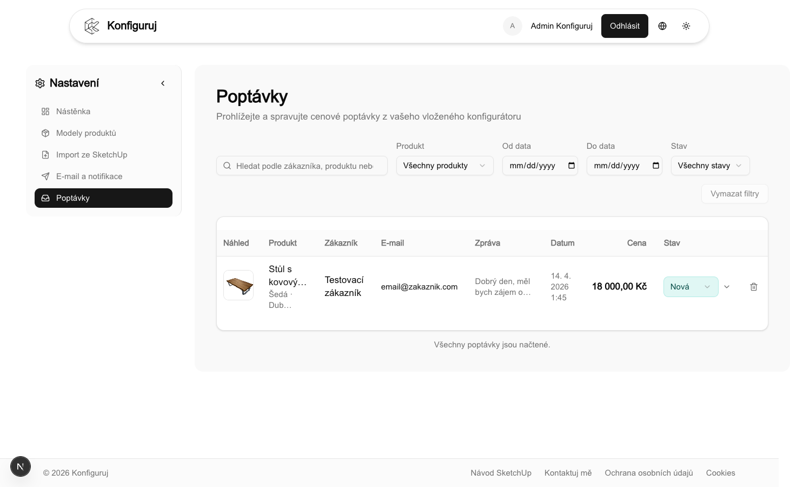

### Detail poptávky

Detail obsahuje obvykle kontaktní údaje zákazníka, zprávu, název produktu, cenu v okamžiku odeslání a přehled zvolené konfigurace. Slouží jako podklad pro následnou komunikaci a interní zpracování.

### Stav poptávky

**Stav** slouží k interní evidenci například hodnotami **Nová**, **Rozpracováno**, **Nabídka odeslána**, **Uzavřeno** a pomáhá sledovat průběh vyřizování.

### Smazání poptávky

Smazání je trvalé a nevratné. Doporučujeme jej jen pro oprávněné případy, například testovací data nebo chybně vytvořené záznamy.

---

## Doporučený postup při novém produktu

1. Importovat model ze SketchUp jako ZIP soubor z pluginu.
2. Zkontrolovat a upravit komponenty, atributy, možnosti a ceny.
3. Ověřit chování v záložce **Náhled**.
4. V **Publikovat a vložit** zapnout publikování, nastavit veřejnou URL a vložit iframe na web.
5. Poptávky vyřizovat v sekci **Poptávky** a aktualizovat jejich stav.

---

## Import ze SketchUp

Konfigurátor přijímá **ZIP z exportního pluginu** (v SketchUp **Pluginy → Konfiguruj Export → Export for Konfiguruj**). V archivu jsou vždy **model.glb** a **parameters.json**. Obrázky textur (PNG nebo JPEG) plugin doplní jen pokud jsou potřeba, často pod cestami typu `materials/…`; **samostatná složka `materials` v ZIP nemusí být přítomna**, pokud se textury neexportují. Systém z načteného ZIP načte model, parametry a nalezené obrázky.

### Návod k pluginu SketchUp

Veřejný dokument **Návod k pluginu SketchUp** je v češtině na `/cs/tutorial`, v angličtině na `/en/tutorial`. Dostupný je z menu nebo z Dashboardu případně přímým zadáním `https://<vaše-doména>/cs/tutorial` (například na produkci `https://www.konfiguruj.com/cs/tutorial`). Popisuje instalaci pluginu (soubor `.rbz`), práci s Dynamic Components a přípravu exportu. Obsah odpovídá logice aplikace; konkrétní kroky se mohou mírně lišit podle vaší verze SketchUp.

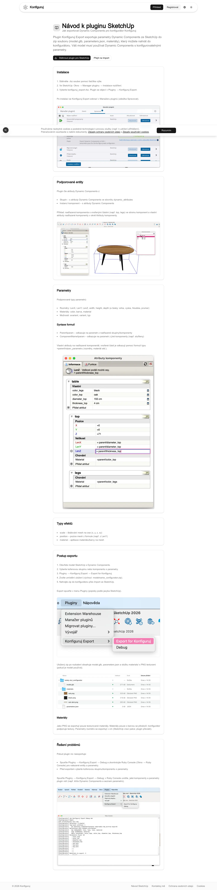

### Stránka Import ze SketchUp

Import spustíte v **Nastavení** v položce **Import ze SketchUp** (cesta `/cs/setup/import/sketchup`). Vyberete configurator ZIP, případně doplníte název produktu; na stránce je také odkaz na stažení pluginu. Úplná adresa: `https://<vaše-doména>/cs/setup/import/sketchup`.

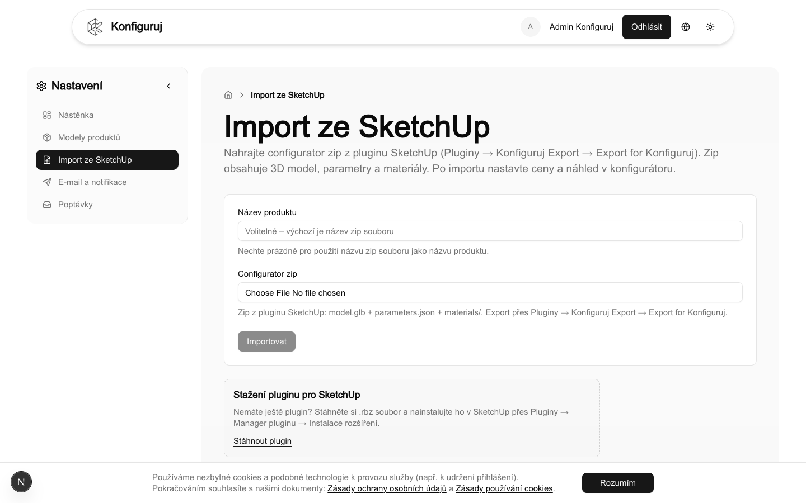

Na **Dashboardu** je rámeček **Tip: Příprava 3D modelu** se stažením pluginu a odkazem na stejný návod. Lokální vývoj typicky používá `http://localhost:3001/cs/tutorial` a `http://localhost:3001/cs/setup/import/sketchup`.

---

## Řešení problémů a podpora

Při problémech s přihlášením, oprávněními nebo ukládáním kontaktujte správce účtu nebo dodavatele řešení. Obecný kontakt je k dispozici na stránce **Kontakt** v hlavičce webu.

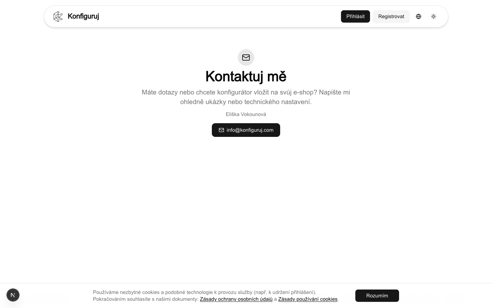
