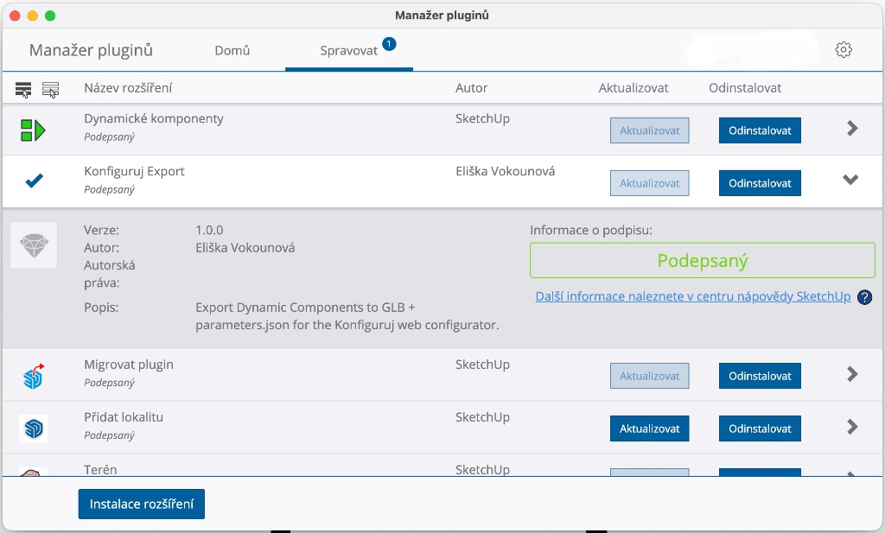
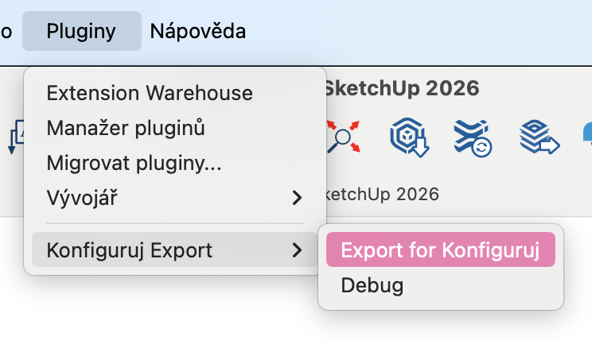

# Konfiguruj Export – SketchUp Plugin

Exports Dynamic Component parameters from SketchUp to `parameters.json` for use with the configurator web app. Supports **one parameter affecting multiple mesh nodes** (e.g. `width` → Top scale, Bottom scale, Legs2 position).

**Note:** After adding this feature, run `pnpm backend:migrate` (with DB running) to apply the `model_3d_effects` column and regenerate jOOQ.

## Debugging

If the plugin doesn't export anything:

1. **Open the Ruby Console** – **Window → Ruby Console** (or **Extensions → Developer → Ruby Console**)
2. Run **Plugins → Konfiguruj Export → Debug**
3. Check the Ruby Console output – it shows what entities, definitions, and dynamic attributes the plugin sees
4. Ensure your root group/component with parameters is **selected** before running Export or Debug

## Installation

1. Package the plugin as `.rbz` (from project root):
   ```bash
   cd tools/sketchup-plugin
   zip -r konfiguruj_export.rbz konfiguruj_export.rb konfiguruj_export/
   ```
   Or run: `./package.sh` if available.

2. In SketchUp: **Window → Extension Manager → Install Extension**
3. Select `konfiguruj_export.rbz`

After installation, **Konfiguruj Export** appears in the Extension Manager (Manage tab), with version, author, and description:



## Usage

1. Open a SketchUp model with Dynamic Components
2. **Plugins → Konfiguruj Export → Export for Konfiguruj** (menu labels match your SketchUp language; Czech UI below)

   

3. Choose save location (default: `modelname_configurator.zip`)
4. The plugin creates a **single zip** containing:
   - **`model.glb`** – 3D model for the configurator
   - **`parameters.json`** – parametric formulas and effects
   - **`materials/`** – PNG textures (when present)
5. **Upload** to configurator: just the zip file (no separate GLB needed)

## Output Format

```json
{
  "parameters": ["..."],
  "components": ["Top", "Bottom", "Legs", "Legs2"],
  "materials": {
    "oak": { "texturePath": "materials/oak.png" }
  }
}
```

Materials are extracted from the SketchUp model: **only textured materials** are exported as PNG in `materials/`. Color-only materials are skipped; the configurator supports textures only. Dimension params (LenX, LenY, LenZ, width, etc.) are exported in **cm** (SketchUp API returns inches; plugin converts).

## Effect Types

| Type      | Description                    | Fields                          |
|-----------|--------------------------------|---------------------------------|
| `scale`   | Scale mesh on axis             | `meshNode`, `axis` (x, y, z, xz) |
| `position`| Position mesh (e.g. from formula) | `meshNode`, `axis`, `multiplier`, `subtractParam` (e.g. LenY), `offsetCm` (e.g. -2.54 for `parent!width-LenX-1`) |
| `material`| Material/color on mesh         | `meshNode`                      |
